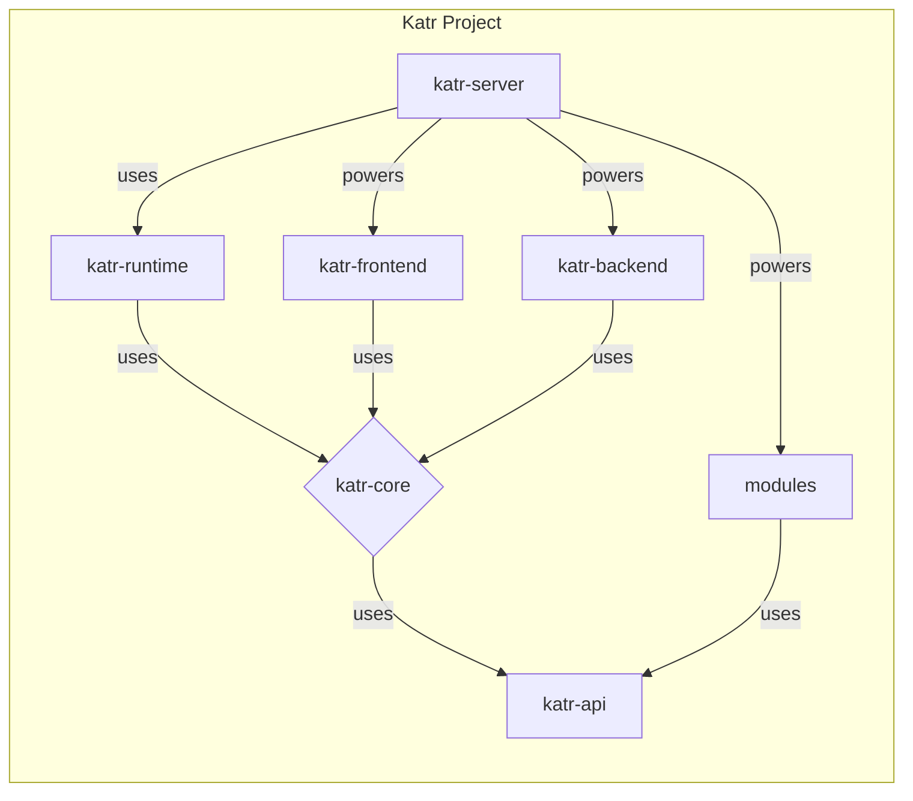

# katr

```mermaid
graph LR
  core{katr-core} -->|uses| api[katr-api]
  runtime[katr-runtime] -->|uses| core
  frontend[katr-frontend] -->|uses| core
  backend[katr-backend] -->|uses| core
  server[katr-server] -->|uses| runtime
  modules[modules] -->|uses| api
  server -->|powers| frontend
  server -->|powers| backend
  server -->|powers| modules
  subgraph katr[Katr Project]
    api
    core
    runtime
    frontend
    backend
    server
    modules
  end
```

## License and Attribution

This project is published under the MIT license.
- [MIT License](LICENSE)